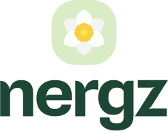

<p align="center">
  
</p>

<h1 align="center">Nergz</h1>

<p align="center">
  <strong>One calm system for the whole shop.</strong><br />
  Sales, stock, purchasing, and cash — in Kurdish &amp; English.
</p>

<p align="center">
  
  
  
  
  
</p>

---

## Overview

**Nergz** is a bilingual marketing site for a shop operations platform built for local stores. It presents checkout, inventory, purchasing, customer ledgers, cash drawers, and reports in a calm, RTL-first experience that switches cleanly between **Kurdish (Sorani)** and **English**.

| Focus | Detail |
| --- | --- |
| Audience | Local shops & pharmacies |
| Languages | Kurdish (default, RTL) · English (LTR) |
| Themes | Light & dark, with system preference |
| Motion | Framer Motion, respects reduced motion |

---

## Features

- **Brand-first hero** — logo, headline, short promise, WhatsApp CTA
- **Live stats strip** — shops served, modules, checkout speed, support
- **Feature grid** — six clear reasons to run the floor on Nergz
- **Day-in-numbers showcase** — checkout, stock health, drawer close rates
- **Partner logos** — local brands growing with the product
- **Locale & theme toggles** — persist in `localStorage`
- **Accessible polish** — focus rings, reduced-motion paths, semantic sections

---

## Tech stack

```text
Next.js 15 (App Router)  ·  React 19  ·  TypeScript
Tailwind CSS  ·  Framer Motion  ·  Lucide React
Plus Jakarta Sans + Noto Sans Arabic
```

---

## Quick start

### Prerequisites

- Node.js **18.18+** (recommended: 20+)
- npm

### Install & run

```bash
npm install
npm run dev
```

Open [http://localhost:3000](http://localhost:3000).

### Scripts

| Command | Description |
| --- | --- |
| `npm run dev` | Start the development server |
| `npm run build` | Create a production build |
| `npm run start` | Serve the production build |
| `npm run lint` | Run ESLint |

---

## Project structure

```text
Sixth/
├── public/images/          # Logo, hero media, partner assets
├── src/
│   ├── app/                # App Router layout & home page
│   ├── components/         # Hero, stats, features, showcase…
│   ├── content/            # Kurdish & English copy (dictionary)
│   ├── context/            # Locale + theme provider
│   └── lib/                # Small utilities
├── tailwind.config.ts
└── package.json
```

Copy and UI strings live in `src/content/dictionary.ts` — edit there to update both languages.

---

## Localization & theming

- Default locale: **`ckb`** (RTL)
- Alternate locale: **`en`** (LTR)
- Theme: **`light`** / **`dark`**, bootstrapped before paint to avoid flash
- Keys stored as `nergz-locale` and `nergz-theme`

---

## Contact

Ready to put Nergz to work? Reach the team on WhatsApp:

**[+964 750 554 1515](https://wa.me/9647505541515)**

Also on [Instagram](https://www.instagram.com/kitn.krd/?hl=en) · [Facebook](https://www.facebook.com/kitngroup) · [X](https://x.com/kitnnet)

---

<p align="center">
  <sub>Built for calm shop operations · نێرگز</sub>
</p>
